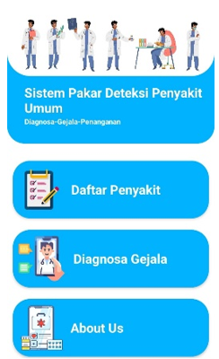
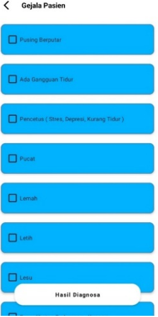
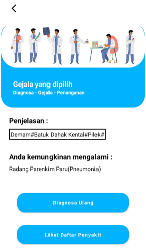

# Aplikasi Konsultasi Awal Keluhan Kesehatan

## Project Overview

Aplikasi Konsultasi Awal Keluhan Kesehatan merupakan sistem informasi berbasis Android yang membantu pengguna melakukan konsultasi awal berdasarkan gejala yang dipilih.

Sistem dirancang untuk memberikan informasi awal mengenai kemungkinan kondisi kesehatan pengguna sebelum melakukan konsultasi lebih lanjut dengan tenaga medis.

Aplikasi menggunakan metode Dempster-Shafer untuk menganalisis data gejala dan menghasilkan kemungkinan diagnosis berdasarkan rule dan basis pengetahuan yang telah ditentukan.

## Business Problem 

Pengguna sering mengalami kesulitan memahami kemungkinan kondisi kesehatan berdasarkan gejala yang dirasakan, terutama dalam menentukan langkah konsultasi awal yang perlu dilakukan.

Selain itu, layanan konsultasi kesehatan tidak selalu mudah diakses oleh beberapa pengguna.

Berdasarkan kondisi tersebut, dikembangkan sebuah sistem informasi yang dapat membantu pengguna memperoleh informasi awal terkait kemungkinan kondisi kesehatan berdasarkan gejala yang dipilih.

## Proposed Solution 

Sistem dirancang untuk membantu pengguna melakukan konsultasi kesehatan berdasarkan gejala yang dipilih melalui aplikasi berbasis Android.

Pengguna dapat memilih gejala yang dirasakan, kemudian sistem akan memproses data tersebut menggunakan metode Dempster-Shafer untuk menghasilkan informasi awal terkait kemungkinan kondisi kesehatan pengguna.

Hasil konsultasi ditampilkan dalam bentuk penjelasan singkat yang dapat membantu pengguna memahami langkah konsultasi selanjutnya.

## Main Features

### User Features

- **Konsultasi Gejala**  
  Pengguna dapat memilih gejala yang dirasakan melalui aplikasi konsultasi awal kesehatan.

- **Hasil Diagnosis**  
  Pengguna menerima informasi kondisi kesehatan awal dari hasil konsultasi sesuai gejala yang dipilih.

- **Informasi Penyakit**  
  Pengguna dapat melihat informasi umum penyakit berdasarkan daftar penyakit yang dipilih.

### Admin Features

- **Manajemen Data Penyakit**  
  Admin dapat melakukan pengelolaan data penyakit.

- **Manajemen Data Gejala**  
  Admin dapat melakukan pengelolaan data gejala berdasarkan data penyakit.

## System Workflow

1. Pengguna memilih gejala yang dirasakan untuk melakukan konsultasi awal.
2. Sistem memproses data gejala yang dipilih.
3. Sistem melakukan perhitungan menggunakan metode Dempster-Shafer.
4. Sistem menampilkan informasi kemungkinan kondisi kesehatan pengguna.

## Technology Used 

**Development**
- Android Studio
- Java
- Firebase Realtime Database

**Method**
- Dempster-Shafer

## Data Structure 

- **Data Penyakit**  
  Menyimpan daftar penyakit yang digunakan untuk konsultasi.

- **Data Gejala**  
  Menyimpan data gejala yang dapat dipilih pengguna saat melakukan konsultasi.

- **Data Relasi Diagnosis**  
  Menyimpan relasi data gejala dan penyakit sebagai dasar proses analisis menggunakan metode Dempster-Shafer.

## Application Preview

| Halaman Utama | Diagnosa Gejala | Hasil Diagnosis |
|---------------|-----------------|-----------------|
|  |  |  |
